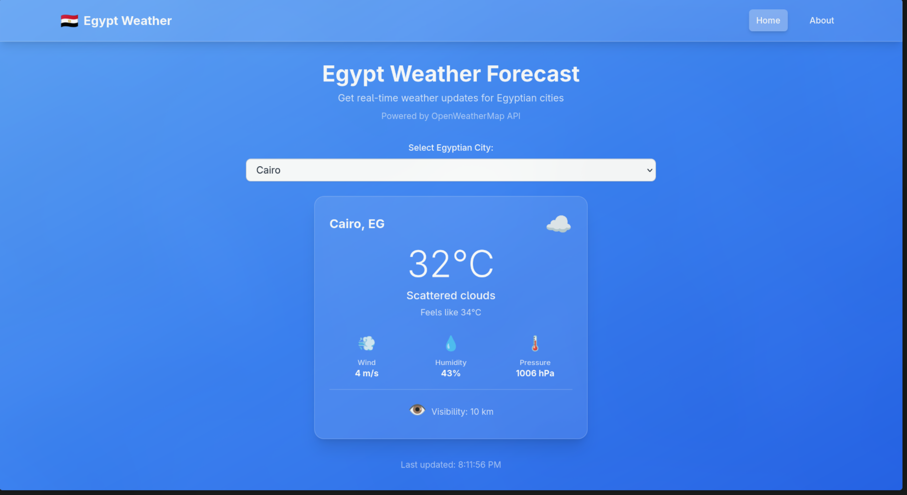
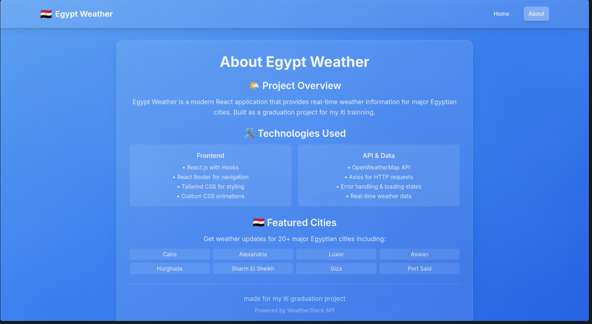
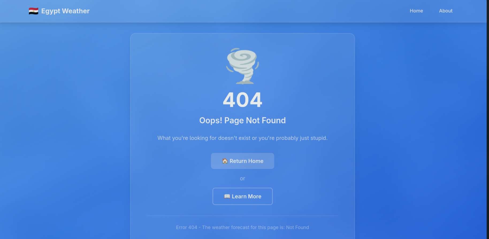

# Egypt Weather App

A React weather application that shows weather data for Egyptian cities. Built during ITI React training.

## Features

- Real-time weather data from OpenWeatherMap API
- 20+ Egyptian cities support
- Responsive design
- Modern UI with Tailwind CSS
- Client-side routing with React Router
- Weather details including temperature, humidity, pressure, wind, visibility

## Tech Stack

- **React.js** - Frontend framework with hooks
- **Vite** - Build tool and dev server
- **React Router** - Client-side routing
- **Axios** - HTTP client for API requests
- **Tailwind CSS** - Utility-first CSS framework
- **OpenWeatherMap API** - Weather data source


## Supported Cities

Cairo, Alexandria, Giza, Luxor, Aswan, Hurghada, Sharm El Sheikh, Port Said, Suez, Mansoura, Tanta, Ismailia, Faiyum, Zagazig, Damietta, Minya, Asyut, Beni Suef, Qena, Sohag

## Weather Data

- Temperature (current and feels-like)
- Weather conditions with icons
- Humidity percentage
- Atmospheric pressure
- Wind speed and direction
- Visibility distance

## Installation & Setup 

1. **Clone the repository**
   ```bash
   git clone <your-repo-url>
   cd egypt-weather-app
   ```

2. **Install dependencies**
   ```bash
   npm install
   ```

3. **Set up environment variables**
   - Get a free API key from [OpenWeatherMap](https://openweathermap.org/api)
   - Replace `API_KEY=''` in `src/services/weatherAPI.js` with your actual API key

4. **Start the development server**
   ```bash
   npm run dev
   ```

5. **Build for production**
   ```bash
   npm run build
   ```
## Screenshots

### 🏠 Home


### ℹ️ About


### ❌ Not Found

